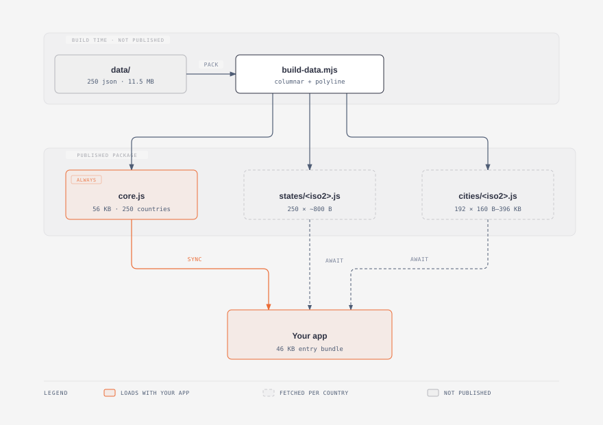

# Countries Atlas 🌎

Look up countries, ISO codes, currencies, calling codes, languages, time zones, states, and cities.

[](https://www.npmjs.com/package/@amplifiedhq/countries-atlas)
[](https://www.npmjs.com/package/@amplifiedhq/countries-atlas)
[](https://github.com/amplifiedhq/countries-atlas/actions)
[](https://github.com/amplifiedhq/countries-atlas/issues)
[](./LICENSE)

The dataset covers 250 countries, 4,857 states, 147,644 cities, 423 time zones, and 155 currencies. Countries load from a 56 KB table. States and cities load per country, on demand, so an application that offers three countries downloads three chunks instead of the whole dataset.



For how the packing works, see [docs/DATA-FORMAT.md](./docs/DATA-FORMAT.md).

Upgrading from v1? Read the [migration guide](./MIGRATION.md). v2 contains breaking changes and ships no deprecation layer.

## Requirements

Node.js 18 or later. The package ships as ES modules only.

CommonJS callers can use `await import()` on every supported version. Plain `require()` works only where Node.js supports requiring an ES module: 20.19 and later in the 20.x line, and 22.12 and later. It raises `ERR_REQUIRE_ESM` on Node.js 18 and 21. See [Install and import](./MIGRATION.md#install-and-import) for the tested matrix.

## Install

```bash
npm install @amplifiedhq/countries-atlas
```

## Quickstart

```ts
import { getCountry } from '@amplifiedhq/countries-atlas';

const country = getCountry('US');
if (country) {
  console.log(country.name, country.callingCodes, country.currency.code);
}
```

Output:

```text
United States [ '1' ] USD
```

`getCountry()` returns `Country | undefined`, so narrow the result before you read from it. The examples below use `?.` for the same reason.

## Entry points

Import only what you need. The subpaths aren't fully independent: `/cities` also loads `/states` to resolve each city's state, and `/translations` needs the core country table.

| Import | Contents | Cost |
| --- | --- | --- |
| `@amplifiedhq/countries-atlas` | Countries, currencies, calling codes, time zones, validators | 56 KB, synchronous |
| `@amplifiedhq/countries-atlas/states` | States and provinces | About 1 KB per country, asynchronous |
| `@amplifiedhq/countries-atlas/cities` | Cities and towns | 160 bytes to 396 KB per country, asynchronous |
| `@amplifiedhq/countries-atlas/flags` | Flag helpers | 3 KB |
| `@amplifiedhq/countries-atlas/flags/*` | Flag SVG, CSS, and Sass assets | Loaded per file |
| `@amplifiedhq/countries-atlas/translations` | Country names in 12 locales | 53 KB plus the 56 KB core table, synchronous |

## Countries

All functions in this section are synchronous. The packed table decodes once, on first use.

### getCountry(code)

Returns the country with the given ISO 3166-1 alpha-2 or alpha-3 code, or `undefined` if no country matches. The lookup ignores case and surrounding whitespace.

```ts
getCountry('US')?.name;   // 'United States'
getCountry('usa')?.name;  // 'United States'
getCountry('XX');         // undefined
```

Once you've narrowed away `undefined`, every field on the result is required, so no further optional chaining is needed inside the object.

```ts
interface Country {
  readonly iso2: string;                  // 'AD'
  readonly iso3: string;                  // 'AND'
  readonly name: string;                  // 'Andorra'
  readonly nativeName: string;            // 'Andorra'
  readonly capital: string;               // 'Andorra la Vella'
  readonly callingCodes: readonly string[];  // ['376']
  readonly currency: Currency;            // { code, name, symbol }
  readonly continent: string;             // 'Europe'
  readonly region: string;                // 'Europe'
  readonly subregion: string;             // 'Southern Europe'
  readonly languages: readonly string[];  // ['ca']
  readonly latitude: number;              // 42.5
  readonly longitude: number;             // 1.5
  readonly emoji: string;                 // '🇦🇩'
  readonly timezones: readonly Timezone[];
}
```

Every field is `readonly`, and the arrays are `readonly` too. Copy a value out before mutating it:

```ts
const codes = [...getCountry('US')!.callingCodes];
```

Returned objects are frozen. Mutating a result throws in strict mode rather than corrupting the shared table.

Countries that use several calling codes return all of them:

```ts
getCountry('DO')?.callingCodes;   // ['1809', '1829', '1849']
```

For the 14 countries whose source record lists several currency codes, `currency.code` holds the first, which is the one `currency.name` and `currency.symbol` describe. Antarctica has no currency and returns an empty `code`.

### getCountries()

Returns all 250 countries, ordered by ISO 3166-1 alpha-2 code. To select fields, map over the result:

```ts
const options = getCountries().map((country) => ({
  value: country.iso2,
  label: `${country.emoji} ${country.name}`,
}));
```

### getCurrencies() and getCurrency(code)

`getCurrencies()` returns the 155 distinct ISO 4217 currencies, ordered by code. `getCurrency(code)` returns one currency, ignoring case, or `undefined`.

```ts
getCurrency('eur');       // { code: 'EUR', name: 'Euro', symbol: '€' }
getCurrencies().length;   // 155
```

To read a single country's currency, use `getCountry('US')?.currency`.

### getTimezones() and getTimezone(name)

`getTimezones()` returns all 423 distinct IANA time zones. `getTimezone(name)` returns one zone, or `undefined`. IANA names are case-sensitive.

```ts
getTimezone('Europe/Andorra');
// {
//   name: 'Europe/Andorra',
//   utcOffset: 3600,
//   utcOffsetName: 'UTC+01:00',
//   abbreviation: 'CET',
//   description: 'Central European Time',
// }
```

`utcOffset` is in seconds. A country's own zones are on its record, at `getCountry('US')?.timezones`.

### getCallingCodes()

Returns one entry per country-and-code pair, so a country with several codes contributes several entries. 257 entries cover 236 distinct codes: `+1` appears three times, once each for Canada, the United States, and the U.S. Minor Outlying Islands. Deduplicate by `code` if your picker needs one row per dial prefix.

```ts
getCallingCodes();
// [{ code: '376', country: { iso2: 'AD', ... } }, ...]   // 257 entries
```

### Validators

Each validator returns a boolean. All ignore case except `isValidTimezone`, because IANA zone names are case-sensitive.

```ts
import {
  isValidCountryCode,
  isValidCurrencyCode,
  isValidTimezone,
  isValidCallingCode,
} from '@amplifiedhq/countries-atlas';

isValidCountryCode('US');             // true, accepts alpha-2 and alpha-3
isValidCurrencyCode('usd');           // true
isValidTimezone('America/New_York');  // true, case-sensitive
isValidCallingCode('+1');             // true, accepts 1, '1', and '+1'
```

## States

```ts
import { getStates, getState } from '@amplifiedhq/countries-atlas/states';

const states = await getStates('US');
// [{ code: 'AL', name: 'Alabama', latitude: 32.31823, longitude: -86.9023 }, ...]

await getState('US', 'CA');   // { code: 'CA', name: 'California', ... }
```

Both functions are asynchronous because each country is a separate module, loaded on demand. After a country loads, `getState()` is a constant-time lookup.

`getStates()` returns an empty array for an unknown country, so you can map the result without a guard. To tell an unknown country from one with no subdivisions, call `isValidCountryCode()`.

States with no coordinates in the source data return `null` for `latitude` and `longitude` rather than `0`.

## Cities

```ts
import { getCities } from '@amplifiedhq/countries-atlas/cities';

await getCities('AD');         // every city in Andorra
await getCities('US', 'CA');   // California only, 1,123 cities
// { name: 'Los Angeles', stateCode: 'CA', latitude: 34.05223, longitude: -118.24368 }
```

A country decodes once and stays cached. Both forms are constant time after that first load, including the per-state form, which reads from an index built during decoding.

## Flags

The package ships all 250 SVGs, two stylesheets, and Sass source. Use whichever of the following fits your build.

### Stylesheet

The browser fetches only the flags it paints, and no bundler is involved.

```ts
import '@amplifiedhq/countries-atlas/flags/css/flags.min.css';
import { flagClass } from '@amplifiedhq/countries-atlas/flags';

flagClass('US');   // 'flag flag-us'
```

```html
<span class="flag flag-us"></span>
```

### Direct import

For bundlers with an SVG loader:

```ts
import us from '@amplifiedhq/countries-atlas/flags/svg/us.svg';
```

TypeScript needs an ambient declaration for this: `declare module '*.svg';`

### Sass

Override the `!default` variables to change the 40×30 sizing:

```scss
@use '@amplifiedhq/countries-atlas/flags/scss/flags' with (
  $flag-width: 24px,
  $flag-height: 18px
);
```

Sass resolves paths on the filesystem rather than through the `exports` map, so `node_modules` has to be on its load path. Bundlers put it there for you. With the Sass CLI, pass it yourself:

```bash
sass --load-path=node_modules input.scss output.css
```

### Emoji

`flagEmoji()` derives a regional indicator pair from the country code, so it needs no asset and no network request. Windows renders the letters rather than a flag, which is why the SVGs exist.

```ts
import { flagEmoji } from '@amplifiedhq/countries-atlas/flags';

flagEmoji('US');   // '🇺🇸'
```

### Remote URLs

`flagUrl()` builds a URL. The bundled assets, both CDNs, and your own host coexist, so choose per call.

```ts
import { flagUrl } from '@amplifiedhq/countries-atlas/flags';

flagUrl('US');                                 // https://flagcdn.com/us.svg
flagUrl('US', { source: 'flag-icons' });       // 4:3, matching the bundled SVGs
flagUrl('US', { baseUrl: '/static/flags' });   // /static/flags/us.svg
flagUrl('US', { format: 'png', width: 160 });  // https://flagcdn.com/w160/us.png
```

`width` accepts one of eight values that flagcdn serves: `20`, `40`, `80`, `160`, `320`, `640`, `1280`, or `2560`. Any other number is a type error.

| Source | Aspect ratio | Formats | Serbia's flag |
| --- | --- | --- | --- |
| Bundled `flags/svg/` | 4:3 | SVG | 884 KB |
| `flagcdn`, the default | Official per flag | SVG, PNG | 29 KB |
| `flag-icons` | 4:3 | SVG | 182 KB |
| `baseUrl` | Yours | Yours | — |

To self-host, copy `flags/svg/` from the package into your static directory and pass its path as `baseUrl`. The filenames are already lowercase alpha-2 codes.

The two CDNs differ in shape as well as size. flagcdn serves each flag in its official ratio, so a row of flags isn't a uniform grid unless you crop with CSS. flag-icons serves every flag at 4:3, matching the bundled assets. Both permit commercial use: flagcdn's flags are public domain through Flagpedia, and flag-icons is MIT.

The bundled SVGs aren't minified. For the measurements behind that decision, see [docs/FLAGS.md](./docs/FLAGS.md).

## Translations

```ts
import {
  getTranslation,
  getTranslations,
  getLocales,
} from '@amplifiedhq/countries-atlas/translations';

getTranslation('AD', 'fr');   // 'Andorre'
getTranslations('AD');        // { br: 'Andorra', cn: '安道尔', de: 'Andorra', ... }
getLocales();                 // ['br', 'cn', 'de', 'es', 'fa', 'fr', ...]
```

These are the dataset's own locale codes, not BCP 47 tags. Korean is `kr`, Chinese is `cn`, and `br` is Brazilian Portuguese.

## Exported types

Every type is exported from the subpath that uses it, so you can annotate your own code.

| Type | Subpath | Description |
| --- | --- | --- |
| `Country` | root | The record `getCountry()` returns |
| `Currency` | root | `{ code, name, symbol }` |
| `Timezone` | root | `{ name, utcOffset, utcOffsetName, abbreviation, description }` |
| `CallingCode` | root | One entry from `getCallingCodes()` |
| `State` | `/states` | `{ code, name, latitude, longitude }` |
| `City` | `/cities` | `{ name, stateCode, latitude, longitude }` |
| `FlagSource` | `/flags` | `'flagcdn' \| 'flag-icons'` |
| `FlagWidth` | `/flags` | The eight raster widths flagcdn serves |
| `FlagUrlOptions` | `/flags` | The options bag for `flagUrl()` |

```ts
import type { Country, Currency } from '@amplifiedhq/countries-atlas';
import type { State } from '@amplifiedhq/countries-atlas/states';
```

## Framework setup

Vite, webpack, Rollup, esbuild, Next.js, and Nuxt need no configuration. Every country chunk is reached through a static `import()`, so bundlers code-split them and ship only the chunks your application can reach.

If you're upgrading from v1, delete the `@rollup/plugin-commonjs` `dynamicRequireTargets` entry and the Nuxt `build.transpile` entry. Both worked around v1's dynamic `require()`, which v2 no longer uses.

### React example

```tsx
import { useEffect, useState } from 'react';
import { getCountries } from '@amplifiedhq/countries-atlas';
import { getStates, type State } from '@amplifiedhq/countries-atlas/states';

function AddressForm() {
  const [iso2, setIso2] = useState('US');
  const [states, setStates] = useState<readonly State[]>([]);

  useEffect(() => {
    let active = true;
    getStates(iso2).then((result) => {
      if (active) setStates(result);
    });
    return () => {
      active = false;
    };
  }, [iso2]);

  return (
    <>
      <select value={iso2} onChange={(event) => setIso2(event.target.value)}>
        {getCountries().map((country) => (
          <option key={country.iso2} value={country.iso2}>
            {country.emoji} {country.name}
          </option>
        ))}
      </select>
      <select>
        {states.map((state) => (
          <option key={state.code} value={state.code}>
            {state.name}
          </option>
        ))}
      </select>
    </>
  );
}
```

## Data accuracy

Coordinates are rounded to five decimal places, which is about 1.1 metres at the equator. The share of source values that already carry no information past the fifth decimal varies by table:

| Table | Values unchanged by rounding |
| --- | --- |
| Cities | 97.35% (287,474 of 295,288) |
| Countries | 81.80% (409 of 500) |
| States | 2.37% (227 of 9,576) |

State coordinates are the outlier: most of them shift, though never by more than about 1.1 metres, which is far below the precision of a subdivision centroid. If you need the source values verbatim, read `data/countries/` from the repository.

Every other field round-trips exactly. The test suite decodes all 250 countries, 4,857 states, and 147,644 cities on each run and compares every field against the raw source JSON.

To report a data error, [open an issue](https://github.com/amplifiedhq/countries-atlas/issues).

## Contributing

```bash
npm install
npm run build:data   # generate src/generated from data/
npm test             # 64 tests, including full data parity
npm run build        # regenerate data and flags, emit dist, report published size
```

The raw JSON in `data/` is the source of truth and isn't published. After editing it, run `npm run build:data`, and the parity test reports any drift.

For the packed data format, see [docs/DATA-FORMAT.md](./docs/DATA-FORMAT.md). For the flag assets, see [docs/FLAGS.md](./docs/FLAGS.md).

## License

MIT © [AmplifiedHQ](https://github.com/amplifiedhq)
